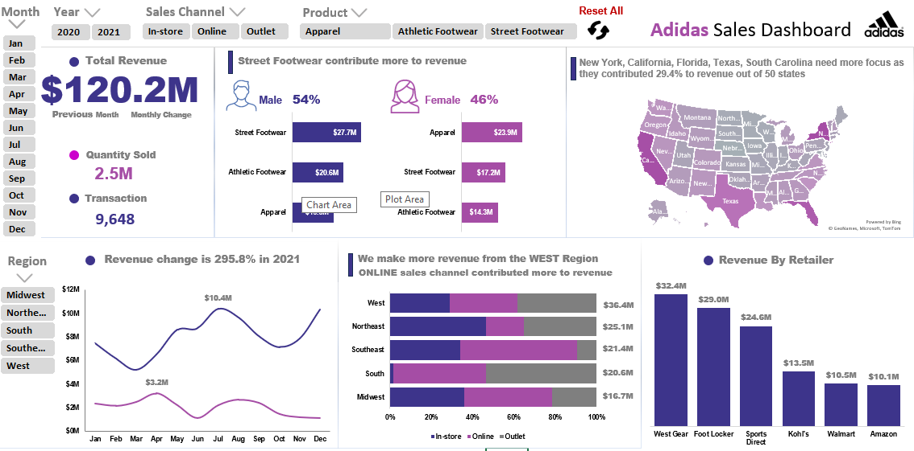
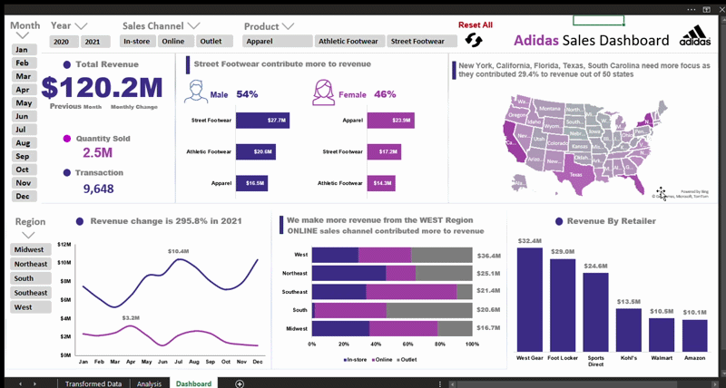

# Sales-Analysis-Dashboard

## Description

Interactive sales dashboard for Adidas products using Excel with pivot tables and slicers.

This dashboard helps visualize sales performance and trends across different sales channels, regions and products for male and female customers.

## Data & Tools Used

**Data** - Sales Data containing over 9600 records across 2020 and 2021.

**Data Source** - ([Adidas Dataset.xlsx](Adidas%20Dataset.xlsx))

**Data Cleaning & Analysis** - Power Query & Pivot Table

**Data Visualization** - Excel ([Adidas Sales.xlsm](Adidas_Sales.xlsm))

## Objective

The company experienced a significant revenue drop in 2020 compared to 2021 and wanted to identify the key drivers behind this decline while providing strategic recommendations to support revenue recovery and future growth. 

## Key Insights
 
- Revenue and sales volume in 2021 both increased about four times compared to 2020 from $24M in 2020 to $96M in 2021, and from 0.5M (2020) to 2M units (2021).
- New York, California and Florida were the top states, contributing about $25M, or about 21% of total revenue.
- Street Footwear was the largest contributor, generating about $45M (37.4% of total revenue), with about 1M units sold, and male buyers contributed 62% of that revenue.
- In 2021, July was the top month at $10.4M, while March was the lowest at $5.2M. In 2020 April led with $3.2M, and December was the lowest at $1.1M.
- For regions, the West was the highest revenue at $36.4M, while the Midwest was the lowest at $16.7M.
- In the South region, in-store sales were just $0.3M, significantly lower than other regions, as only one state, Louisiana, out of the seven states was active.
- January has the highest outlet sales each year.

## Root Causes

- Geographic Coverage: Limited, only 9 states were active in 2020, compared to 46 states in 2021.
- Sales Channel: Low emphasis on the online channel in 2020, contributing just 18% of revenue ($4.5M), compared to 42% ($40.4M) in 2021.
- Marketing: Limited marketing campaigns in 2020, especially in new regions, reduced brand exposure.
- Economic Factors: External challenges, such as market instability and reduced consumer demand in 2020, significantly impacted revenue.
  
## Recommendations

- Focus on the top revenue-generating states like New York, California and Florida to sustain and accelerate revenue growth.
- Focus on Street Footwear by increasing marketing efforts and expanding promotions specifically targeting male customers.
- Focus on the online sales channel, as it currently contributes the largest share of revenue. Increase investment in targeted digital marketing and improve website user experience, such as load speed and navigation, to reach a 50% revenue contribution next year.
- Expand efforts in the South region by identifying potential locations, partnering with local businesses and launching targeted marketing campaigns to increase foot traffic and boost in-store sales in this region.
- Plan early promotions, stock up, and start marketing in advance to make the most of January revenue.
