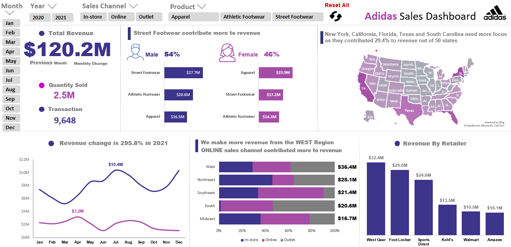
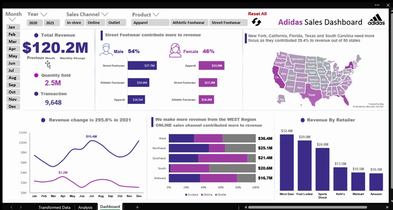

# Sales-Analysis-Dashboard

## Description

Interactive sales dashboard for Adidas products using Excel with pivot tables and slicers.

This dashboard help visualize sales performance and trends across different sales channels and products for male and female.

## Data & Tools Used

**Data** - Sales Data with over 9600 rows in 2020 & 2021.

**Data Source** - ([Adidas Dataset.xlsx](Adidas%20Dataset.xlsx))

**Data Cleaning & Analysis** - Power Query & Pivot Table

**Data Visualization** - Excel

## Problem

The company observed a substantial decline in sales during 2020 compared to 2021. The company wanted to understand the factors that caused this dramatic drop in 2020 so they could pinpoint the root cause and take action to recover and grow in the future. 

## Root Causes

- Only 9 states were active in 2020, compared to 46 states in 2021.
- A key factor was the low emphasis on the online sales channel, which only contributed 18% of revenue (4.5$M), while in 2021, it surged to 42% (40.4$M).
- Marketing campaigns were not expanded to new regions in 2020.
- Unexpected disruptions in the global economic environment in 2020, which led to a decline in demend and a drop in revenues across many markets.

 ## Key Insights
 
- Revenue and sales volume in 2021 both increased about four times compared to 2020 from 24$M to 96$M, and from 0.5M to 2M units.  
- Street Footwear was the largest contributor, generating about 45$M out of 120$M in revenue (37.4%), with about 1M units sold, and male buyers contributed 62% of that revenue.
- New York, California and Florida were the top states, contributing about 25$M, or about 21% of total revenue.
- In 2021, July was the top month at 10.4$M , while March was the lowest at 5.2$M. In 2020 April led with 3.2$M, and December was the lowest at 1.1$M.
- For regions, the West was the highest revenue at 36.4$M , while the Midwest was the lowest at 16.7$M.

## Recommendations

- We need to focus more on the online sales channel, as it currently contributes the largest share of revenue, and we plan to achieve 50% next year.
- In the South region, in-store sales were just 0.3$M, significantly lower than other regions, as only one state, Louisiana, out of the seven states was active. We need to expand efforts in the other states by identifying potential locations, partnering with local businesses and launching targeted marketing campaigns to foot traffic to boost in-store sales in this region.
